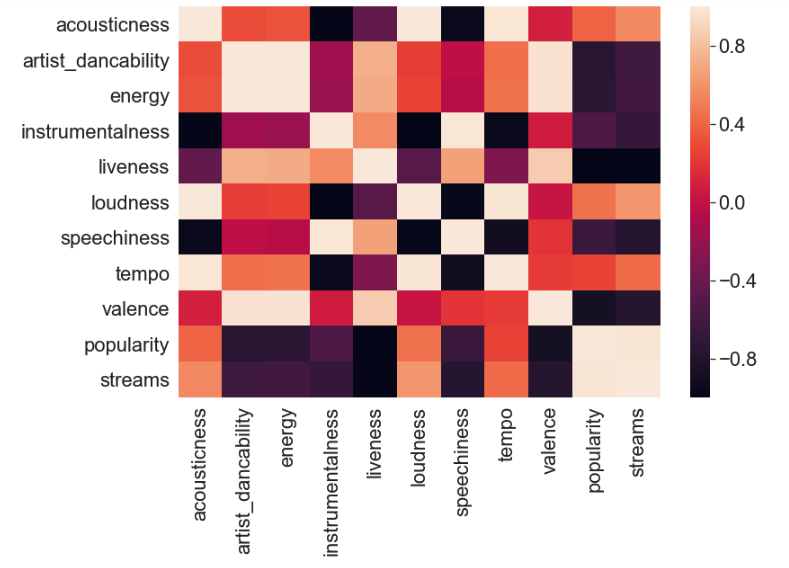

# Mod_3_project

# Background

Music streaming company Spotify launched in Europe in 2008 and at the time most people in the US used either Apple music or the radio to listen to music. Three years later in 2011 Spotify launched in the US and became the leading force in the music streaming business. In 2017, it bough Tencent music and vice verse, kept enlarging the territory of its music leadership role globally. It has been a NYSE public company since 2018. What is most interesting is that this is where lots of data scientists favorite place to work with.

We are interested in an overall picture of the users of spotify. Our "stakeholder" are potentially from a musical festival organizations. They want to know some insights on Spotify users and some key artists to book for their next music festivals.

# Hypothesis

## 1. Does the streaming country have a significant impact on the number of streams?
--- First of all, we want to have a holistic picture of the users globally, according to the statistics from Statistica, Spotify' major users are from Europe, Latin America and North America, but we want to confirm whether the latest weekly users's demographic information plays a role on the weekly streams.
 
We want to look at the following hypotheses:

H0: The means of weekly number of streams on spotify on all country groups are equal

H1: The means of weekly number of streams on spotify on at least one country group is different.
 
## 2. Do the most popluar artists in each region of the world have different danceability ratings?
--- When organizing a music festival it is important to understand what the festival-goers want from their expereince. Traditionally a key part of the music festival experience is dancing with other festival goers. But not every region of the world may have the same desire for dancability.   
 
We want to look at the following hypotheses:

H0: All regions of the world have equal dancability in their most listend to artists.

H1: The artist dancability for each region's favorite arists are not statistically similar.

## 3. Do people want to listen to artists that make more dancable music?
--- Many artists may have not interest in the dancability of their music. But as a music festival, do you want to book artists you don't make danceable music?

We want to look at the following hypotheses:

H0: Dancability has not effect on the number of streams a song receives. 

H1: People listen to more dancable music more.

# Conclusions

## Hypothesis Test 1

Despite the fact that spotify has a majority of its users located in Europe, the vast majority of streams come from US. This disproves our null hyothessis that the means of each coutries streams are the same and confirms our alternate hypothesis that the streaming nubers are not the same fror each country.

Additionally the number of streams by continent shows us that North America eclipses other continents in terms of the number of streams observed.  

## Hypthoesis Test 2 

The result of our second hypothesis test show that there is not 

## Hypthoesis Test 3

Our third hypothesis testing the correlation between the characteristsics of music and what makes the music successful revealed that danceability has an effect on the the number of streams a song receives. But the effect is actually significantly negatively correlated. Music that is more danceable is often listened to less than music that is not danceable to a 62% degree of certainty.   

## Key Takeaways
1. Cultural/Country Factor play a role in impacting streaming statistics. The US leads in the number of weekly streams compared with other regions despite Europe having a majority of spotify users.
2. Latin America’s top tracks are more danceable compared with other continents.
3. Loud songs with a high BPM, that are not necessarily danceabile are streamed the most. 

